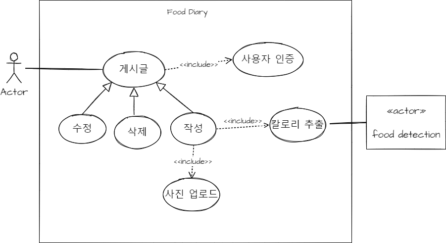
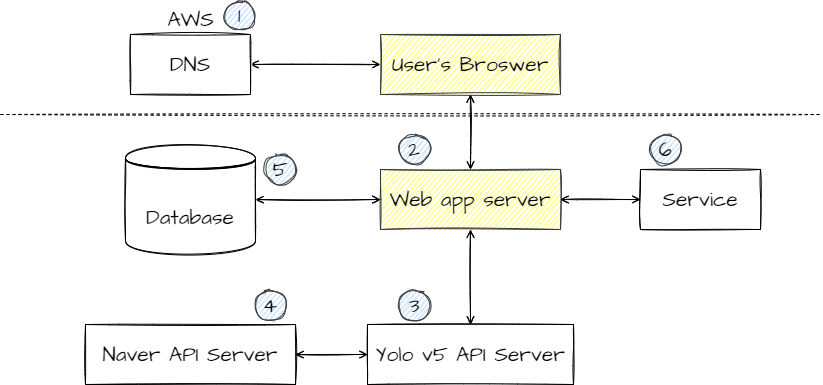
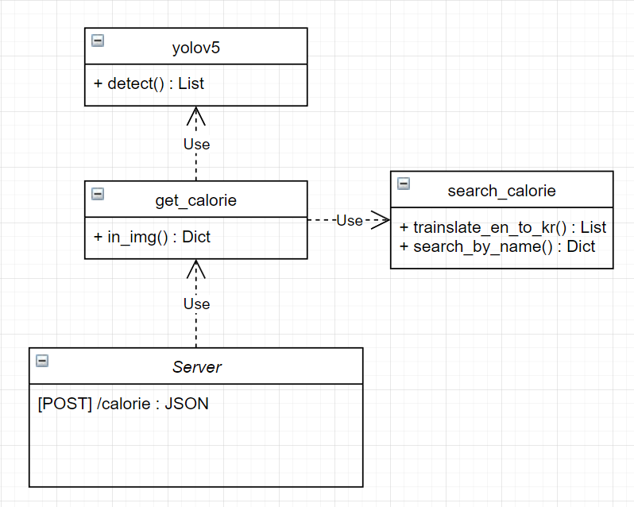
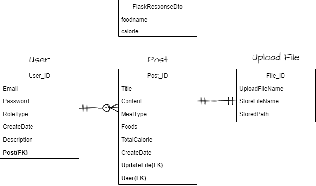
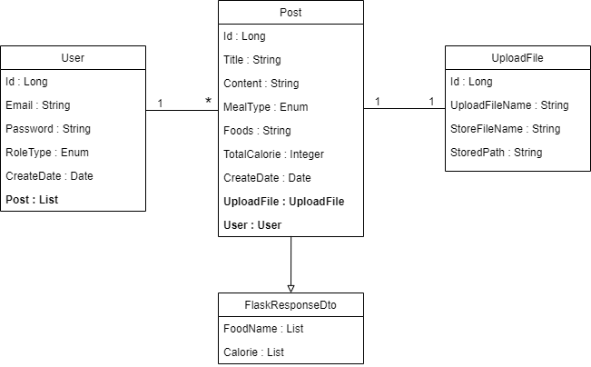
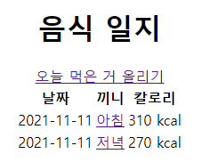
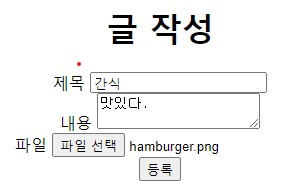
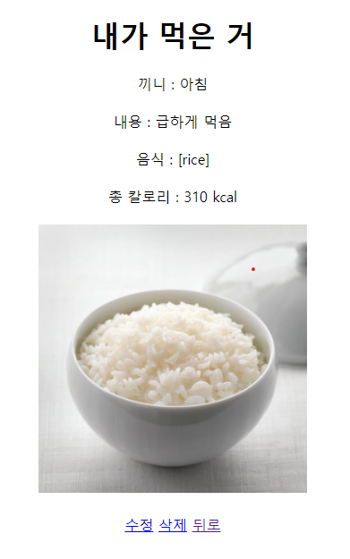

# DIBLY

### 종합 헬스 서비스 개발

## 1. 개요

- Springboot 기반의 웹서비스 제작
- Flask로 API 서버 구축 및 REST API 호출
- HTTP Protocol

## 2. 요구사항

**User Requirements**

- 글쓰기, 조회, 수정, 삭제
- 사진 업로드
- 칼로리 확인
- 전체 업로드 리스트 확인
- 로그인 : Oauth 2.0 소셜 로그인(Google)

**Developver Requirements**

1. Springboot : 웹서버로써 사용자 UI 제공
	- 내부 API Request / Response
	- External API Request / Response
	- 로그인을 위한 Session / Cookie
	- 소셜 로그인을 위한 Oauth 2.0

4. Flask : API 서버 (욜로v5)
	- 음식 인식 : image file
	- 음식이름 번역 : en food name
	- 음식 칼로리 크롤링 : kr food name

**Use-Case Diagram**

## 3. 시스템 설계

**Web Architecture**

### 1) **Web App Server**

**View**

- /main : 블로그로 들어갈 수 있는 페이지
- /login : 로그인을 하는 페이지 (Oauth)
- /posts : 전체 글 목록을 보는 페이지
- /posts/post : 글 작성을 하는 페이지
- /posts/post/{id} : 단일 글 내용 확인

**API**

RESTful API를 설계했습니다.

- [GET] / : main으로 redirect하는 URL
- [GET] /main : 메인페이지를 제공하는 URL
- [GET] /posts : 글 목록을 제공하는 URL

- [GET] /posts/post : 글 작성 페이지를 제공하는 URL
- [POST] /posts/post : 새 글을 저장하는 URL

- [GET] /posts/post/{id} : 단일 글 정보를 제공하는 URL
- [POST] /posts/post/{id} : 글 수정 요청을 하는 URL
- [DELETE] /posts/post/{id} : 글 삭제 요청을 하는 URL

- [GET] /image/{filename} : filename에 대한 이미지 파일을 제공하는 URL

### 2) **API Server**

- [POST] /calorie : 음식 칼로리 응답
- detect : 사진, 모델 학습 weight를 받아 class 검출
- get_calorie : 이미지에서 음식 검출
- search_calorie : Naver API 요청, 칼로리 크롤링

### 3) **DB**

**Entity-Relationship Diagram**

데이터베이스 설계를 위한 객체 관계 다이어그램

**UML 상세 다이어그램**

### 4) **UI**

**기능 구현에 중점을 뒀습니다.**

- 전체 일지 목록

    

-----------------------------------
- 글 올리기

    

-----------------------------------
- 세부사항

    

## 추후 계획

- [X] UI 개선
- [ ] React로 Front-end 구현
- [X] Oauth 2.0으로 소셜 로그인 구현 (Google)
- [X] 현재 API서버 응답 시간이 1초 정도걸리는데 이를 단축
    - Yolo 저장소에서 모델을 불러옴 -> detect 함수에서 바로 검출값을 리턴하도록 함. **0.2x초로 단축**
- [ ] Yolo v5 모델 개선
    - 아직 다양한 음식들을 검출해내지 못 함.
- [X] AWS로 호스팅
- [X] DB : RDS로 변경
- [ ] 모바일 환경 최적화하기. 모바일에서 사진 올리면 안 올라감.

## 어려웠던 점

- Spring - Flask 간 통신 과정
- `Multipart/form-data`를 어떻게 요청 메세지에 담을 것인가.
- 이는 `RestTemplate`라는 Spring 라이브러리를 사용함.
- 처음 파일만 보내고 그 파일을 Flask에서 받아 칼로리를 Response 해주기로 함.
- 하지만 파일을 바이너리 데이터 형태로 보내야함. 그리고 Restful API를 위해 전송 데이터는 JSON으로 한정지음.
- 그래서 이미지 파일을 바이너리화 해서 스트링으로 변환 후 Json Type으로 전송함.
- 플라스크에서는 해당 String을 `Base64`로 String to Binary 디코딩하여 파일을 저장함.
- Yolov5의 detect는 이미지를 경로에서 읽어옴 -> 맨 처음에는 저장소에서 불러와서 1.x초가 걸렸는데 수정 후 0.x초 걸림
- json 전송 시 json.dumps -> jsonify 를 두 번 해줘서 서버에서 응답을 제대로 안 해줬다.
